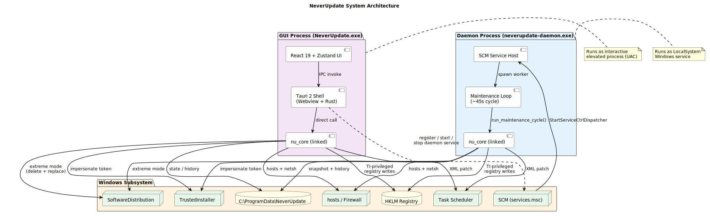
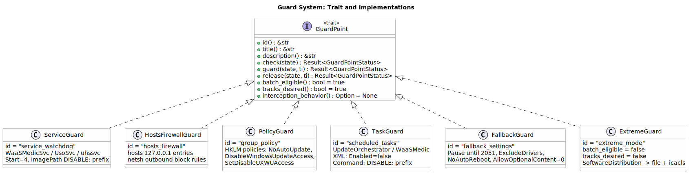
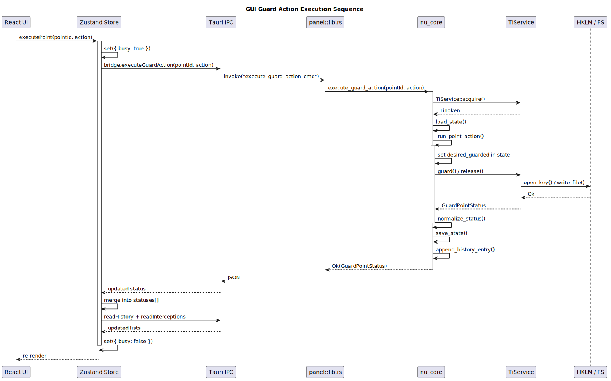
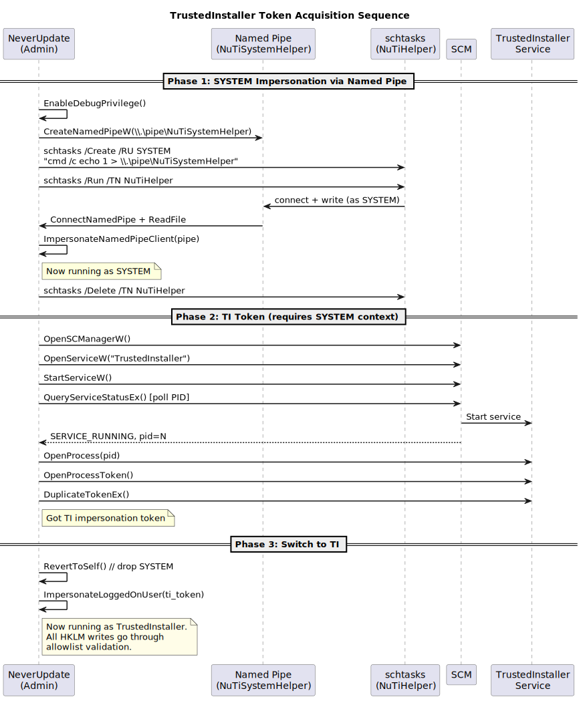
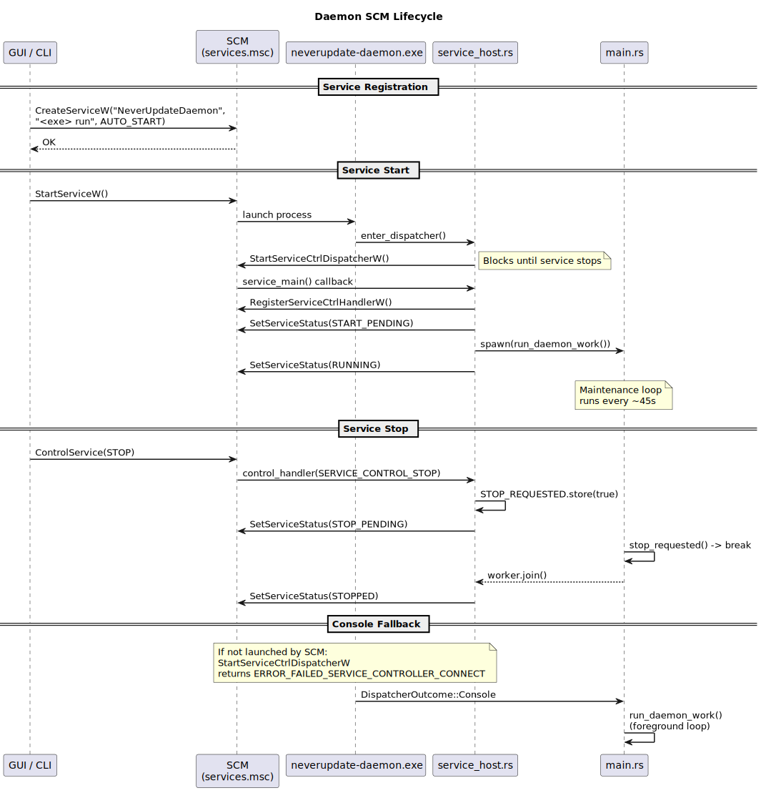
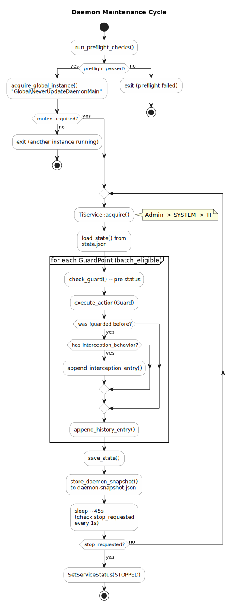

# NeverUpdate

我再也不要被强迫更新 Windows 系统了！

## 概述

**NeverUpdate (NU) 是一个激进的 Windows 11 平台专用的系统更新阻断工具，旨在简易、彻底、长期可靠、可逆地停止 Windows 自动更新，将用户被剥夺的“不更新系统”的权利归还给用户。**

它通过多层机制（TrustedInstaller 提权、服务注册表篡改与破坏、hosts/防火墙规则、组策略、计划任务 XML 补丁、兜底注册表设置、SoftwareDistribution 站桩）持续**对抗 Windows Update 的自动下载与安装**。

### 特殊路径

大量流传的更新阻止技巧，大多依赖 Windows Update 自身所提供的阻断机制，这些机制本就在微软的掌控之中，很不可靠，实践中也的确经常反弹。NU 采用了规则以外的技巧来完成对更新路径的破坏。

### 暗改对抗

在开发 NU 的过程中，是明显看到 Windows Update 在暗中偷偷恢复被禁止的更新行为的，包括但不限于：

- 暗改服务的禁用状态，
- 重建被破坏的 wuauserv 服务，
- 暗改超长的更新推迟时间点等

NU 将通过守护进程周期性巡检并自愈阻断状态，确保阻断状态的持久性。

### 持久战

总的来说，NU 会在用户的机器中常驻，通过守护进程打持久战，并确保低占用运行，用积极防御的态度，定期巡检，不断防止 Windows Update 反扑，确保将自动更新彻底按死。

---

## 为什么要这么做？

被自动更新耽误工作事小，但是被自动推送了 BIOS 更新，更新到了一个带有 bug 的版本，一夜之间电脑就开机卡自检了，定位问题、修电脑所花的代价，就是开发 NU 的无数动力之一。

## 系统架构

<p align="center"></p>

系统由三个核心组件构成：

| 组件 | 二进制 | 运行身份 | 职责 |
|------|--------|----------|------|
| **GUI 面板** | `NeverUpdate.exe` | 交互式提权进程 (UAC) | 用户界面、阻断点操控、守护进程管理 |
| **守护进程** | `neverupdate-daemon.exe` | `LocalSystem` Windows 服务 | 周期性巡检并自愈阻断状态 |
| **核心库** | `nu_core` (静态链接) | — | 所有阻断逻辑、TI 提权、状态持久化 |

两个二进制均静态链接 `nu_core`，可独立运行。GUI 通过 Tauri IPC 调用 Rust 后端暴露的命令；守护进程直接调用 `nu_core::run_maintenance_cycle()`。

---

## 技术栈

### Rust (后端)

| 依赖 | 用途 |
|------|------|
| `windows-sys` | Win32 API 绑定：SCM、Token 操作、命名管道、Mutex |
| `winreg` | HKLM 注册表读写 |
| `chrono` | 时间戳 (UTC) |
| `serde` / `serde_json` | 结构体序列化与 JSONL 持久化 |
| `thiserror` | 错误类型定义 |
| `is_elevated` | UAC 提权检测 |
| `pico-args` | 守护进程 CLI 参数解析 |
| `tauri` 2.x + plugins | GUI shell、IPC、自动更新、单实例 |

### 前端

| 依赖 | 用途 |
|------|------|
| React 19 | UI 框架 |
| Zustand 5 | 全局状态管理（单 store） |
| Sass / CSS Variables | 主题与样式 |
| Vite 7 | 开发服务器与构建 |
| Font Awesome 7 Free | 图标 |
| react-markdown | 原理说明渲染 |
| `@tauri-apps/api` | Tauri IPC bridge |
| `@tauri-apps/plugin-updater` | 应用自动更新 |
| `@tauri-apps/plugin-process` | `relaunch()` |

### 构建与发布

| 工具 | 用途 |
|------|------|
| Bun | 前端依赖安装与构建 |
| Cargo | Rust workspace 构建 |
| GitHub Actions | CI/CD，`release` 分支触发 |
| `tauri-action` v0.6.0 | 打包 NSIS 安装器，生成更新签名 |
| minisign | 更新包签名验证 |

---

## 项目结构

```
neverupdate/
├── Cargo.toml                    # Workspace: core, daemon, panel/src-tauri
├── core/                         # nu_core — 共享核心逻辑库
│   └── src/
│       ├── lib.rs                # 公开 API
│       ├── guards/               # 阻断点实现 (6 个)
│       │   ├── mod.rs            # GuardPoint trait + registry
│       │   ├── service_guard.rs
│       │   ├── hosts_firewall_guard.rs
│       │   ├── policy_guard.rs
│       │   ├── task_guard.rs
│       │   ├── fallback_guard.rs
│       │   └── extreme_guard.rs
│       ├── ti_service.rs         # TrustedInstaller 令牌获取
│       ├── daemon_service.rs     # SCM 服务注册/启动/停止
│       ├── system_check.rs       # 前置检查 (preflight)
│       ├── state.rs              # PersistedState (JSON)
│       ├── history.rs            # JSONL 操作记录与拦截记录
│       ├── pathing.rs            # ProgramData 路径定义
│       ├── command.rs            # 子进程执行工具
│       ├── model.rs              # 公共数据模型
│       ├── error.rs              # NuError 定义
│       └── extreme.rs            # 极端模式实现
├── daemon/                       # neverupdate-daemon — 守护进程二进制
│   └── src/
│       ├── main.rs               # CLI + 主循环
│       └── service_host.rs       # SCM dispatcher + handler
├── panel/                        # Tauri 桌面应用
│   ├── src/                      # React 前端
│   │   ├── main.tsx
│   │   ├── App.tsx               # 根组件、路由、主题
│   │   ├── store/index.ts        # Zustand 全局 store
│   │   ├── bridge/index.ts       # Tauri invoke 封装
│   │   ├── types.ts              # TypeScript 类型定义
│   │   ├── content/principles.ts # 阻断原理 Markdown
│   │   ├── styles/colors.scss    # CSS 变量 (亮/暗主题)
│   │   └── components/           # UI 组件
│   └── src-tauri/
│       ├── src/lib.rs            # Tauri command handlers
│       ├── tauri.conf.json       # 窗口、插件、更新器配置
│       └── capabilities/         # Tauri ACL
└── .github/workflows/
    └── release.yml               # CI/CD
```

---

## 前置检查 (Preflight)

`system_check::run_preflight_checks()` 在 GUI 启动和守护进程每次启动时执行，验证运行环境：

| 检查项 | ID | 条件 |
|--------|-----|------|
| Windows 11 | `windows11` | `ProductName` 包含 "Windows 11" 或 `Build >= 22000` |
| 非 Server | `not_server` | `InstallationType` 不包含 "server" |
| 非 LTSC | `not_ltsc` | `ProductName` 不包含 "ltsc" |
| 管理员权限 | `admin` | `is_elevated()` 或 `LocalSystem` token |
| 写入验证 | `admin_verified` | 实际向 `HKLM\SOFTWARE` 写入并删除测试键 |
| TI 可用 | `trusted_installer` | `TiService::probe()` 成功获取 TI token |
| 单实例 | `single_instance_probe` | `Global\NeverUpdatePreflightProbe` mutex 可创建 |

任一检查不通过，GUI 停留在诊断页面，守护进程拒绝启动。

---

## 阻断点系统 (Guard System)

### GuardPoint Trait

<p align="center"></p>

所有阻断点实现 `GuardPoint` trait：

```rust
pub trait GuardPoint: Send + Sync {
    fn id(&self) -> &'static str;
    fn title(&self) -> &'static str;
    fn description(&self) -> &'static str;
    fn check(&self, state: &PersistedState) -> Result<GuardPointStatus>;
    fn guard(&self, state: &mut PersistedState, ti: &TiService) -> Result<GuardPointStatus>;
    fn release(&self, state: &mut PersistedState, ti: &TiService) -> Result<GuardPointStatus>;
    fn batch_eligible(&self) -> bool { true }
    fn tracks_desired(&self) -> bool { true }
    fn interception_behavior(&self) -> Option<&'static str> { None }
}
```

- `batch_eligible`: 是否参与"一键阻断/放开"批量操作
- `tracks_desired`: 是否在 `PersistedState.desired_guarded` 中跟踪期望状态（用于 breach 判定）
- `interception_behavior`: 守护进程巡检时，若发现某点从 unguarded 被恢复为 guarded，会记录一条拦截日志，此方法返回日志描述

### 阻断点注册表

`guards::registry()` 按固定顺序返回所有实现：

| # | ID | 类名 | 批量 | 追踪 |
|---|----|------|------|------|
| 1 | `service_watchdog` | `ServiceGuard` | Yes | Yes |
| 2 | `hosts_firewall` | `HostsFirewallGuard` | Yes | Yes |
| 3 | `group_policy` | `PolicyGuard` | Yes | Yes |
| 4 | `scheduled_tasks` | `TaskGuard` | Yes | Yes |
| 5 | `fallback_settings` | `FallbackGuard` | Yes | Yes |
| 6 | `extreme_mode` | `ExtremeGuard` | **No** | **No** |

### 状态归一化

`normalize_status()` 在每次 `check` 或 `execute_action` 后调用，根据 `desired_guarded` map 判定 breach 状态：

- 若 `tracks_desired == false`，`breached` 始终为 `false`
- 若 `desired_guarded` 中期望 guarded，但实际 `!guarded`，则 `breached = true`
- 默认期望为 `true`（即首次未操作时也按 breach 处理）

### 阻断/释放执行流程

<p align="center"></p>

---

## 阻断点详解

### 1. ServiceGuard (`service_watchdog`)

**目标服务**: `WaaSMedicSvc`、`UsoSvc`、`uhssvc`

**阻断机制**:
- 通过 TI 权限写入 `HKLM\SYSTEM\CurrentControlSet\Services\{name}`
- 设置 `Start = 4` (Disabled)
- 在 `ImagePath` 值前添加 `DISABLE:` 前缀，使服务即使被启动也无法找到可执行文件
- 原始 `Start` 值和 `ImagePath` 存储在 `PersistedState.service_start_backup` / `service_image_path_backup` 中

**释放**: 从备份恢复原始 `Start` 和 `ImagePath`；无备份时 `Start` 默认恢复为 `3` (Manual)

**检查**: 读取注册表验证 `Start == 4 && ImagePath.starts_with("DISABLE:")`

### 2. HostsFirewallGuard (`hosts_firewall`)

**hosts 封锁**:
- 在 `%WINDIR%\System32\drivers\etc\hosts` 中插入标记块：
  ```
  # NeverUpdate BEGIN
  127.0.0.1 *.windowsupdate.com
  127.0.0.1 *.update.microsoft.com
  127.0.0.1 *.delivery.mp.microsoft.com
  # NeverUpdate END
  ```
- hosts 文件的读写通过 `TiService` 的 allowlist 路径验证

**防火墙规则**:
- 通过 `netsh advfirewall firewall add rule` 添加出站阻止规则：
  - `NeverUpdate_Block_WaaSMedic` → `WaaSMedicAgent.exe`
  - `NeverUpdate_Block_UsoClient` → `UsoClient.exe`
  - `NeverUpdate_Block_musNotify` → `musNotification.exe`

**释放**: 移除 hosts 标记块，删除防火墙规则

### 3. PolicyGuard (`group_policy`)

通过 TI 权限在 HKLM 下创建/修改以下注册表键值：

| 注册表路径 | 值 | 阻断时 |
|-----------|------|---------|
| `...\WindowsUpdate\AU\NoAutoUpdate` | DWORD | `1` |
| `...\WindowsUpdate\AU\AUOptions` | DWORD | `1` |
| `...\WindowsUpdate\DisableWindowsUpdateAccess` | DWORD | `1` |
| `...\PolicyManager\...\Update\SetDisableUXWUAccess` | DWORD | `1` |

**释放**: 将值设回 `0`（`AUOptions` 恢复为 `3`）

### 4. TaskGuard (`scheduled_tasks`)

**目标**: `%WINDIR%\System32\Tasks\Microsoft\Windows\UpdateOrchestrator\*` 和 `WaaSMedic\*`

**阻断机制**:
- 直接操作任务 XML 文件（不使用 `schtasks` 命令）
- 设置 `<Enabled>false</Enabled>`
- 在所有 `<Command>` 值前添加 `DISABLE:` 前缀
- 原始 XML 内容备份在 `PersistedState.task_command_backup`
- 支持 UTF-16LE (BOM) 和 UTF-8 编码的任务文件

**释放**: 从备份恢复原始 XML；无备份时仅移除 `DISABLE:` 前缀并设 `<Enabled>true</Enabled>`

### 5. FallbackGuard (`fallback_settings`)

设置多组"兜底"注册表值：

| 类别 | 键值 | 设定 |
|------|------|------|
| 暂停更新 | `PauseUpdatesExpiryTime` | `2051-12-31T00:00:00Z` |
| | `PausedFeatureStatus` / `PausedQualityStatus` | `1` |
| | `FlightSettingsMaxPauseDays` | `0x2727` (10023 天) |
| 驱动排除 | `ExcludeWUDriversInQualityUpdate` | `1` |
| 升级禁止 | `DisableOSUpgrade` | `1` |
| 可选内容 | `AllowOptionalContent` | `0` |
| 重启抑制 | `NoAutoRebootWithLoggedOnUsers` | `1` |
| | `AlwaysAutoRebootAtScheduledTime` | `0` |

### 6. ExtremeGuard (`extreme_mode`)

**特殊属性**: `batch_eligible = false`，`tracks_desired = false`。不参与任何一键操作，GUI 中需要二次确认。

**执行**:
1. 调用 `ServiceGuard` 禁用所有服务（包括 `wuauserv`，即 Windows Update 主服务）
2. 删除 `%WINDIR%\SoftwareDistribution` 目录
3. 在原路径创建一个同名**文件**（写入标记文本）
4. 通过 `icacls` 锁定 ACL：
   - 移除继承权限
   - 设置当前用户为 owner
   - 仅授予当前用户 Full Control

**检查**: 判断 `SoftwareDistribution` 路径是否存在且为**文件**（而非目录）

---

## TrustedInstaller 提权机制

<p align="center"></p>

NeverUpdate 需要 TrustedInstaller 级别权限来修改被 Windows 保护的注册表键（如服务配置）。`TiService` 模块实现了一个三阶段提权流程：

### Phase 1: Admin → SYSTEM（命名管道技巧）

1. `EnableDebugPrivilege()` — 启用当前进程的调试权限
2. 创建命名管道 `\\.\pipe\NuTiSystemHelper`
3. 通过 `schtasks` 创建一个以 `SYSTEM` 身份运行的一次性任务：`cmd /c echo 1 > \\.\pipe\NuTiSystemHelper`
4. 立即运行该任务
5. SYSTEM 进程连接管道并写入数据
6. 调用 `ImpersonateNamedPipeClient()` 模拟管道客户端（即 SYSTEM）的身份
7. 清理临时任务

### Phase 2: SYSTEM → TI Token

1. 以 SYSTEM 身份打开 SCM
2. 启动 `TrustedInstaller` 服务
3. 轮询 `QueryServiceStatusEx()` 获取 TI 进程 PID（最多 5 秒）
4. `OpenProcess()` → `OpenProcessToken()` → `DuplicateTokenEx()` 获取 TI 的模拟令牌

### Phase 3: 切换至 TI

1. `RevertToSelf()` 放弃 SYSTEM 身份
2. `ImpersonateLoggedOnUser(ti_token)` 切换为 TrustedInstaller

### Allowlist 安全约束

`TiService` 对所有注册表和文件操作施加严格的路径白名单验证：

**注册表前缀白名单** (`ALLOWED_REG_PREFIXES`):
- `SYSTEM\CurrentControlSet\Services\WaaSMedicSvc`
- `SYSTEM\CurrentControlSet\Services\UsoSvc`
- `SYSTEM\CurrentControlSet\Services\uhssvc`
- `SYSTEM\CurrentControlSet\Services\wuauserv`
- `SOFTWARE\Policies\Microsoft\Windows\WindowsUpdate`
- `SOFTWARE\Microsoft\WindowsUpdate`
- `SOFTWARE\Microsoft\PolicyManager\current\device\Update`

**文件路径白名单**:
- `\System32\drivers\etc\hosts`
- `\System32\Tasks\Microsoft\Windows\UpdateOrchestrator`
- `\System32\Tasks\Microsoft\Windows\WaaSMedic`
- `\SoftwareDistribution`

任何不在白名单内的路径操作会被 `validate_key()` / `validate_file()` 拒绝并返回 `NuError::InvalidOperation`。

### `as_admin()` 上下文切换

部分操作（如 `netsh` 调用、注册表读取检查）不需要 TI 权限，且在 TI 上下文中反而可能失败。`TiService::as_admin()` 临时调用 `RevertToSelf()` 回到管理员上下文执行闭包，完成后自动恢复 TI 模拟。

---

## 守护进程机制

### SCM 生命周期

<p align="center"></p>

守护进程注册为 Windows 服务 `NeverUpdateDaemon`，启动类型为 `AUTO_START`（随系统启动），以 `LocalSystem` 身份运行。

**注册**: `CreateServiceW()` 创建服务，`binPath = "<exe> run"`，附加服务描述 `"NeverUpdate privileged maintenance daemon"`

**启动流程**:
1. SCM 启动 `neverupdate-daemon.exe run`
2. `enter_dispatcher()` 调用 `StartServiceCtrlDispatcherW()`
3. SCM 回调 `service_main()`
4. 注册控制处理器 (`RegisterServiceCtrlHandlerW`)
5. 报告 `START_PENDING`
6. 在新线程中启动 `run_daemon_work()`
7. 报告 `RUNNING`

**停止**:
1. SCM 发送 `SERVICE_CONTROL_STOP`
2. `control_handler` 设置 `STOP_REQUESTED` (AtomicBool)
3. 报告 `STOP_PENDING`
4. 主循环检测到 stop 信号后退出
5. `worker.join()` 后报告 `STOPPED`

**控制台回退**: 如果进程不是由 SCM 启动（如开发调试），`StartServiceCtrlDispatcherW` 返回 `ERROR_FAILED_SERVICE_CONTROLLER_CONNECT`，此时直接以前台模式运行 `run_daemon_work()`。

### 维护循环

<p align="center"></p>

```
loop:
  if stop_requested → break
  TiService::acquire()
  load_state()
  for each GuardPoint (batch_eligible):
    before = check_guard()
    execute_action(Guard)
    if was !guarded → append_interception_entry()
    append_history_entry()
  save_state()
  store_daemon_snapshot()
  sleep ~45s (check stop every 1s)
```

每个周期约 45 秒，循环期间：
- 获取 TI 令牌（每次循环重新获取）
- 加载持久化状态
- 遍历所有 `batch_eligible` 阻断点，执行 `Guard` 操作
- 若某阻断点在本次巡检前处于 unguarded 状态（被系统恢复），记录拦截日志
- 保存状态和快照

### 数据快照

守护进程每次循环结束后将完整状态写入 `daemon-snapshot.json`。GUI 通过 `load_daemon_snapshot()` 读取该快照展示守护进程状态，无需与守护进程直接通信。

### 全局互斥

`acquire_global_instance("Global\\NeverUpdateDaemonMain")` 确保同一时刻只有一个守护进程实例运行。

---

## 持久化

所有数据存储在 `%ProgramData%\NeverUpdate\` 下：

| 文件 | 格式 | 用途 |
|------|------|------|
| `state.json` | JSON | `PersistedState`: 服务备份、任务备份、期望状态 |
| `history.jsonl` | JSONL | 操作记录，最多 500 条（FIFO 裁剪） |
| `interceptions.jsonl` | JSONL | 拦截记录，最多 500 条 |
| `daemon-snapshot.json` | JSON | 守护进程最后一次循环的完整状态快照 |

### PersistedState 结构

```rust
pub struct PersistedState {
    pub service_start_backup: HashMap<String, u32>,
    pub service_image_path_backup: HashMap<String, String>,
    pub task_command_backup: HashMap<String, String>,
    pub desired_guarded: HashMap<String, bool>,
}
```

### JSONL 裁剪

`trim_jsonl_tail()` 在每次 append 后检查行数，超过 `MAX_HISTORY_ITEMS (500)` 时截断最早的记录。

---

## 前端架构

### IPC 层

`bridge/index.ts` 封装所有 Tauri `invoke` 调用，类型安全地映射到后端 `#[tauri::command]` 函数。所有调用均为异步。

**可用命令**:

| Bridge 方法 | Rust 命令 | 返回类型 |
|------------|-----------|---------|
| `runPreflightChecks()` | `run_preflight_checks_cmd` | `PreflightReport` |
| `listGuardPoints()` | `list_guard_points_cmd` | `GuardPointDefinition[]` |
| `queryGuardStates()` | `query_guard_states_cmd` | `GuardPointStatus[]` |
| `executeGuardAction(id, action)` | `execute_guard_action_cmd` | `GuardPointStatus` |
| `executeAll(action)` | `execute_all_cmd` | `GuardSummary` |
| `readHistory(limit)` | `read_history_cmd` | `HistoryEntry[]` |
| `clearHistory()` | `clear_history_cmd` | `void` |
| `readInterceptions(limit)` | `read_interceptions_cmd` | `InterceptionEntry[]` |
| `clearInterceptions()` | `clear_interceptions_cmd` | `void` |
| `daemonSnapshot()` | `daemon_snapshot_cmd` | `DaemonSnapshot?` |
| `daemonServiceRegister()` | `daemon_service_register` | `boolean` |
| `daemonServiceReregister()` | `daemon_service_reregister` | `boolean` |
| `daemonServiceStart()` | `daemon_service_start` | `boolean` |
| `daemonServiceStop()` | `daemon_service_stop` | `boolean` |
| `daemonServiceUnregister()` | `daemon_service_unregister` | `boolean` |
| `runExtremeMode()` | `run_extreme_mode_cmd` | `boolean` |

### 状态管理 (Zustand)

单一 store (`useAppStore`) 管理所有全局状态：

**核心状态字段**:
- `loading` / `busy` / `lastError` — 加载与操作互斥
- `riskAccepted` — 风险声明是否已接受 (`localStorage`)
- `preflight` — 前置检查结果
- `points` / `statuses` — 阻断点定义与实时状态
- `history` / `interceptions` — 操作/拦截记录
- `daemonSnapshot` — 守护进程快照
- `updaterCheckEnabled` / `updateToastVisible` — 更新器控制 (`localStorage`)
- `updateAvailable` / `updateStatus` / `updateMessage` — 更新状态

**并发控制**: `withBusy()` 包装器在异步操作执行期间设置 `busy = true`，防止重复操作，并自动捕获错误到 `lastError`。

### 组件层级

```
App
├── RiskGate          (if !riskAccepted)
├── Diagnostics       (if preflight failed / manual)
├── Settings          (if showSettings)
└── Main Dashboard
    ├── StatusHero    — 状态概览、批量操作、刷新
    ├── GuardMatrix   — 阻断点列表、逐项操作、原理说明
    └── aside
        ├── DaemonControl        — 守护进程管理
        └── AdditionalFeatures   — 记录、极端模式
UpdateToast           (fixed 定位，条件渲染)
```

路由通过 `App.tsx` 中的条件渲染实现，无 React Router。

### 主题系统

- CSS 变量定义在 `styles/colors.scss`，分 `:root` (亮色) 和 `:root[data-theme='dark']` (暗色)
- `App.tsx` 中 `theme` 状态持久化到 `localStorage`，通过 `data-theme` 属性切换
- 主题切换时通过 `nu-disable-theme-transition` class 临时禁用所有 CSS transitions（使用双重 `requestAnimationFrame` 确保样式应用后再移除 class）

### 应用自更新

- 基于 `@tauri-apps/plugin-updater`
- 双 endpoint: 自建 API (`neverupdate-api.vanillacake.cn`) + GitHub Releases
- 更新包使用 minisign 签名验证
- 安装模式: `basicUi` (NSIS)
- 前端通过 Zustand store 管理更新状态机: `idle → checking → ready/latest/error → downloading → relaunch`
- 自动检测到更新时在右下角显示 toast；手动检查在 Settings 页面

---

## CI/CD

`release.yml` 在 `release` 分支 push 时触发：

1. **Checkout** + 安装 Bun + Rust stable
2. **Cargo 缓存恢复** (registry + target)
3. `bun install` — 前端依赖
4. `cargo build -p nu_daemon --release` — 构建守护进程
5. 将 `neverupdate-daemon.exe` 复制到 `panel/src-tauri/bin/`（Tauri bundle resource）
6. **tauri-action** — 构建 Tauri 应用，生成 NSIS 安装器和更新签名
7. 上传 `neverupdate-daemon.exe` 作为独立 release asset

Tauri bundler 将 `bin/neverupdate-daemon.exe` 作为 resource 打包进安装包，运行时通过 `resolve_bundled_daemon_path()` 定位（优先 resource dir → 开发模式 target/release → target/debug）。

---

## 安全模型

1. **最小权限放大**: 进程以管理员启动，仅在需要时提升至 SYSTEM/TI，操作完成后释放
2. **路径白名单**: TI 上下文下的所有注册表和文件操作都经过 allowlist 验证，防止越权
3. **状态追踪**: 所有操作均记录到 JSONL 历史，供审计
4. **互斥锁**: GUI 和守护进程通过不同的 global mutex 防止冲突
5. **签名验证**: 自更新使用 minisign 公钥验证安装包完整性
6. **单实例**: Tauri `single-instance` 插件防止多个 GUI 实例
